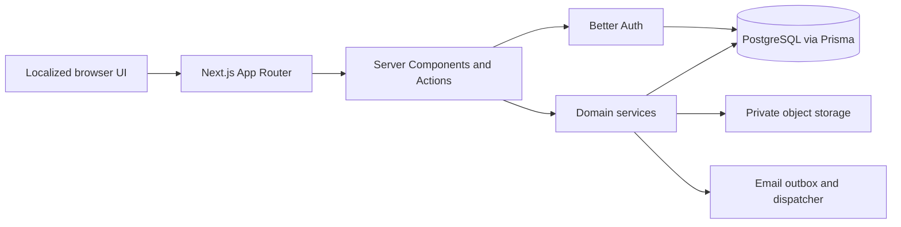

# CareerBridge

CareerBridge is a production-oriented hiring platform for Candidates,
Recruiters, and platform Admins. It combines job discovery, structured
applications, private Company workspaces, interviews, notifications, analytics,
moderation, and four-locale delivery in one server-first Next.js application.

- Production: <https://careerbridge-puce.vercel.app>
- Languages: English, Turkish, Azerbaijani, and Russian
- [Final release-readiness & portfolio audit](docs/final-release-readiness-audit.md)
- [Product specification](docs/product-spec.md)
- [Architecture](docs/architecture.md)

> **Release status:** The production deployment and public smoke suite are live.
> Candidate registration, login, dashboard access, and signed-out Candidate route
> protection have been manually verified. Recruiter Company/Job creation, the
> Application/Interview journey, Admin production flows, real-recipient email
> delivery, and recurring dispatcher ownership remain **UNVERIFIED**. Present
> CareerBridge as a substantial production-oriented portfolio project, not yet as
> a fully production-ready hiring service.

## Highlights

- Candidate and Recruiter registration with a server-owned role allow-list
- Database-backed sessions and server authorization on every protected surface
- Candidate profiles, Saved Jobs, versioned CVs, Applications, Interviews,
  notifications, and private analytics
- Recruiter profiles, multi-Company membership, Jobs, applicant pipelines,
  private notes, Interviews, team invitations, and analytics
- Admin moderation with immutable audit history
- Transactional email outbox with idempotent claiming, retries, and dead letters
- Four-locale routes, validation, metadata, and event-time delivery
- Controlled Vercel deployment, isolated PostgreSQL integration tests, production
  environment validation, health checks, and read-only smoke tooling

## Verification legend

- **Implemented** — source code and routes exist.
- **Automated-tested** — unit and/or isolated integration coverage exists.
- **Manually verified** — the named production behavior was directly exercised.
- **UNVERIFIED** — implemented or documented, but not exercised in the current
  production audit.

## Feature matrix

| Area                                             | Implementation | Automated evidence                                              | Production evidence                                                       |
| ------------------------------------------------ | -------------- | --------------------------------------------------------------- | ------------------------------------------------------------------------- |
| Public localized pages                           | Implemented    | Locale, routing, metadata, header, and smoke tests              | Public smoke **PASS**                                                     |
| Candidate registration/login/dashboard           | Implemented    | Auth schema, role, logging, and integration tests               | Manual **PASS**                                                           |
| Signed-out Candidate route denial                | Implemented    | Central session/role guards                                     | Manual **PASS**                                                           |
| Candidate profile/Saved Jobs/documents/analytics | Implemented    | Unit and integration tests                                      | **UNVERIFIED** beyond dashboard                                           |
| Recruiter profile/Company/team                   | Implemented    | Unit and integration tests                                      | **UNVERIFIED**                                                            |
| Job publish/close/archive lifecycle              | Implemented    | Unit and integration tests                                      | **UNVERIFIED**; reopening is absent                                       |
| Candidate Application/Recruiter pipeline         | Implemented    | Unit and integration tests                                      | **UNVERIFIED**                                                            |
| Interview scheduling/responses                   | Implemented    | Unit and integration tests                                      | **UNVERIFIED**                                                            |
| Notifications/preferences                        | Implemented    | Unit and integration tests                                      | **UNVERIFIED**                                                            |
| Email outbox/dispatcher                          | Implemented    | Provider, dispatcher, and integration tests                     | Recipient delivery and recurring Cron **UNVERIFIED**                      |
| Admin moderation/audit/analytics                 | Implemented    | Unit and integration tests                                      | **UNVERIFIED**                                                            |
| Four-locale product surface                      | Implemented    | Dictionary, validation, routing, formatting, and delivery tests | Locale roots smoke **PASS**; full browser/editorial matrix **UNVERIFIED** |

Synthetic production data used during prior verification has been cleaned up. The
current audit does not create replacement data.

## Architecture

CareerBridge is a single Next.js 16 App Router application. Server Components own
reads and page authorization; Server Actions own validated mutations; small Client
Components are limited to interactive forms and controls. Prisma and providers are
initialized lazily so builds do not require live infrastructure.



Key trust boundaries:

- Navigation is presentation only; protected pages and mutations revalidate the
  session and exact role on the server.
- Domain reads and writes are Candidate-, ownership-, membership-, or Admin-scoped.
- Public Job/Company queries share publication and moderation predicates.
- History, notifications, and email intent commit atomically where required.
- CV objects stay private and download only through a re-authorizing route.
- Production diagnostics avoid secret and private-payload output.

See [docs/architecture.md](docs/architecture.md) for the domain model and access
matrices.

## Repository structure

```text
careerbridge/
├── src/
│   ├── app/          # Routes, Route Handlers, metadata, and styles
│   ├── components/   # Shared layout and UI primitives
│   ├── features/     # Domain UI, rules, reads, and mutations
│   ├── generated/    # Generated Prisma client; do not edit
│   ├── i18n/         # Routing, dictionaries, formatting, and SEO
│   └── lib/          # Auth, Prisma, storage, environment, infrastructure
├── prisma/           # Schema and source-controlled migrations
├── tests/            # Unit and isolated integration suites
├── scripts/          # Validation, operational, and smoke commands
├── docs/             # Product, architecture, deployment, operations, roadmap
└── .github/workflows # CI and controlled production deployment
```

## Technology

- Next.js 16, React 19, and TypeScript
- Tailwind CSS 4, shadcn/ui, and Radix UI
- PostgreSQL, Prisma 7, and Better Auth
- Zod and React Hook Form
- Vitest unit and isolated PostgreSQL integration tests
- Vercel, Neon-oriented PostgreSQL, private S3-compatible storage, and Resend

## Local setup

### Prerequisites

- Node.js 20.9+; Node 22.23.1 is pinned in `.nvmrc`
- npm
- A dedicated development PostgreSQL database, isolated from production and tests

### Install

```bash
npm ci
```

Create an untracked local environment file:

```powershell
Copy-Item .env.example .env
```

Configure values without committing or printing them. The template contains names
only.

| Group          | Variables                                                | Development policy                        |
| -------------- | -------------------------------------------------------- | ----------------------------------------- |
| Application    | `APP_BASE_URL`                                           | Local application origin                  |
| Database       | `DATABASE_URL`, `DIRECT_URL`                             | Development database only                 |
| Authentication | `BETTER_AUTH_URL`, `BETTER_AUTH_SECRET`                  | Local origin and dedicated local secret   |
| Documents      | `DOCUMENT_STORAGE_DRIVER`, `DOCUMENT_STORAGE_LOCAL_ROOT` | Local driver is development/test only     |
| Email          | `EMAIL_DELIVERY_DRIVER` and related `EMAIL_*` names      | Prefer the non-network development driver |
| Integration    | `RUN_DATABASE_INTEGRATION_TESTS`, `TEST_DATABASE_URL`    | Dedicated test database only              |

Generate Prisma code, apply development migrations, and start the app:

```bash
npm run prisma:generate
npm run prisma:migrate:dev
npm run dev
```

Open <http://localhost:3000>. Never run development migration, seed, bootstrap, or
cleanup commands against production.

### Development Admin

Admin is not a public registration role. The guarded bootstrap requires documented
`ADMIN_BOOTSTRAP_*` values, a dedicated database, and
`ADMIN_BOOTSTRAP_ENABLED=true`:

```bash
npm run admin:bootstrap
```

It is development-only and refuses known production environments.

## Testing

| Command                                      | Purpose                                        | Production data                   |
| -------------------------------------------- | ---------------------------------------------- | --------------------------------- |
| `npm test`                                   | Database-free unit tests                       | Never                             |
| `npm run test:integration`                   | Explicit isolated PostgreSQL integration tests | Never                             |
| `npm run lint`                               | ESLint                                         | Never                             |
| `npm run typecheck`                          | Next.js type generation and TypeScript         | Never                             |
| `npm run format:check`                       | Prettier check                                 | Never                             |
| `npm run build`                              | Production build                               | Build-safe through lazy providers |
| `npm run smoke:production -- <https-origin>` | Read-only public checks                        | Read-only                         |

CI runs Prisma generation/validation, unit tests, lint, typecheck, formatting, and
build. Its serialized integration job requires `TEST_DATABASE_URL`, migrates only
that isolated database, and then runs integration tests. There is no authenticated
browser E2E suite or coverage threshold.

## Production deployment

Canonical production: <https://careerbridge-puce.vercel.app>

The controlled workflow checks out an exact commit, installs the lockfile, validates
the pulled Production environment, runs quality gates, builds a prebuilt artifact,
applies source-controlled migrations only after build success, deploys that artifact,
and runs the read-only smoke suite.

```bash
npm run smoke:production -- https://careerbridge-puce.vercel.app
```

Smoke covers the locale redirect, four locale roots, robots, sitemap, readiness, and
security headers. It does not prove authenticated roles, provider delivery, private
document authorization, or browser accessibility.

Read [deployment](docs/deployment.md) and the
[operations runbook](docs/operations-runbook.md) before production work.

## Accessibility, localization, SEO, and security

Implemented foundations include landmarks, a skip link, focus styles, labeled
controls, keyboard-aware role selection, mobile-menu focus restoration, responsive
layouts, light/dark themes, localized document language, canonical alternates,
robots/sitemap generation, server authorization, secure production cookies,
conservative headers, rate limits, redacted logs, and private document delivery.

Still required: authenticated browser E2E, automated accessibility checks, full
desktop/mobile/keyboard/screen-reader/four-locale QA, Core Web Vitals baselines, a
tested Content Security Policy, and complete protected multi-role verification.

## Screenshots

**No screenshots have been added yet — this is still outstanding for portfolio
v1.** Real, sanitized captures still need to be produced. Add only captures with
no email, account, private Company, Application, CV, meeting, token, or
production data.

Planned set:

1. Localized landing and Job discovery
2. Candidate dashboard on desktop and mobile
3. Recruiter Company/Job workspace with synthetic local data
4. Admin moderation/analytics with synthetic local data
5. Light/dark comparison

See [docs/screenshots/README.md](docs/screenshots/README.md).

## Limitations and roadmap

- Email ownership verification, password reset, and account recovery are absent.
- Recruiter Company/Job and Application/Interview production journeys are
  **UNVERIFIED**.
- Admin, private CV, Notification, Analytics, and full localization production QA
  remain **UNVERIFIED**.
- Arbitrary-recipient email delivery and recurring Cron ownership are **UNVERIFIED**.
- There is no EmailOutbox operational UI, authenticated browser E2E, or Job reopen.
- The public Company page currently shows a phase-era "jobs coming next"
  placeholder card instead of that company's published Jobs; discovery works via
  `/jobs`.
- Registration requires accepting Terms and Privacy, but public `/terms` and
  `/privacy` routes and policy documents are not yet published.
- CSP, performance baselines, alert ownership, and restore/rotation drills remain.
- Job recommendations and AI assistance are deferred; AI makes no hiring decisions.
- No public license is selected; normal copyright rules currently apply.

See the [final release-readiness & portfolio audit](docs/final-release-readiness-audit.md)
and the [roadmap](docs/roadmap.md).

## Portfolio use

CareerBridge is suitable for job applications as evidence of full-stack architecture,
authorization, relational modeling, testing, localization, delivery workflows, and
production-operations thinking. Describe it as a **production-oriented portfolio
application with a live verified Candidate path**. Do not call skipped Recruiter,
Application, Interview, Admin, email, or Cron workflows production-verified.

## Documentation

- [Final release-readiness & portfolio audit](docs/final-release-readiness-audit.md)
- [Product specification](docs/product-spec.md)
- [Architecture
