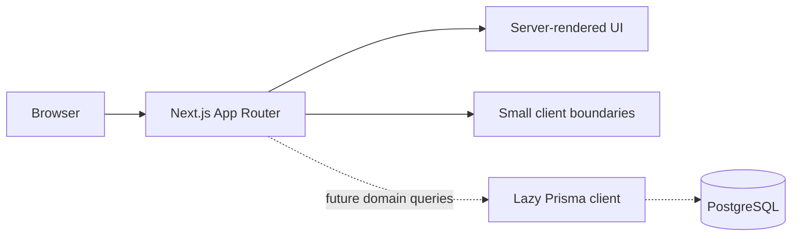

# CareerBridge architecture

## Architecture goals

CareerBridge should support incremental delivery without locking the product into premature abstractions. The foundation favors framework conventions, typed boundaries, server-first rendering, and a relational domain that can grow alongside real workflows.

## Current system

CareerBridge is a single Next.js App Router application:



The public foundation is statically renderable and does not require a database connection. The Prisma client is created only when the shared getter is called, keeping builds independent of runtime secrets.

## Source boundaries

- **src/app:** route composition, metadata, layouts, and route-specific entry points
- **src/components/ui:** shadcn/ui source owned by the repository
- **src/components/layout:** cross-route site chrome
- **src/components/shared:** reusable presentational components
- **src/features:** domain-oriented UI and, in later phases, actions, schemas, and queries
- **src/config:** stable site configuration and mock foundation data
- **src/lib:** infrastructure clients and low-level utilities
- **src/types:** genuinely shared TypeScript contracts
- **prisma:** database configuration, schema, and future migrations

New folders should be created only when they have an implementation to hold.

## Rendering model

- Pages and layouts are React Server Components by default.
- Client Components are limited to browser state or event-driven interaction.
- Current client boundaries are theme switching, the theme provider, Radix primitives, and the mobile navigation sheet.
- Public foundation pages are prerendered during the production build.
- Future personalized routes will use server rendering and carefully placed loading boundaries.

## Planned application layers

Feature modules will evolve toward a consistent shape without requiring every feature to use every layer:

```text
features/<feature>/
├── components/     # Feature UI
├── schemas/        # Zod input and output contracts
├── server/         # Queries, commands, and authorization
└── types.ts        # Feature-local contracts when needed
```

Route files should compose feature modules rather than accumulating domain logic.

## Data architecture

- PostgreSQL is the system of record.
- Prisma 7 provides type-safe access through the PostgreSQL driver adapter.
- The schema is intentionally model-free in Phase 0.
- Domain design and migrations begin only after identity, tenancy, ownership, and lifecycle rules are specified.
- Database access remains server-only and is acquired through the lazy singleton helper.

Likely future domain areas include identity, candidate profiles, companies and memberships, jobs, saved jobs, applications and status history, documents, moderation, notifications, and audit events. This list is directional, not a committed schema.

## Authentication and authorization

Auth.js is planned for the next phase. Authentication will establish identity and session management; authorization remains an application responsibility.

Authorization must be checked close to protected reads and mutations in Server Actions, Server Components, or Route Handlers. Request middleware or proxy logic must never be the only authorization gate.

The first identity design must settle:

- Whether one user can hold multiple platform roles
- Company membership and recruiter permissions
- Admin elevation and audit requirements
- Session duration and account recovery
- Account deletion and data retention behavior

## Validation and forms

- Zod will validate data at every untrusted boundary.
- React Hook Form is deferred until interactive forms are implemented.
- Server-side validation remains authoritative even when client validation exists.
- Form components must provide accessible labels, instructions, errors, and pending states.

## File and document handling

CV upload is not implemented in the foundation. A later design must use private object storage, short-lived access URLs, content-type and size validation, malware scanning where appropriate, retention rules, and explicit recruiter authorization.

## Security and privacy

- Secrets live in environment variables and never in tracked files.
- Database and service clients are server-only and initialized lazily.
- Protected mutations require authentication, authorization, validation, and audit context.
- Sensitive candidate data follows least-privilege access.
- Security headers, rate limiting, CSRF posture, content policy, and abuse controls are hardened before public launch.

## Accessibility and interface system

- shadcn/ui and Radix primitives provide accessible interaction foundations.
- Theme variables are the source of truth for color and surface styling.
- Light and dark themes must both meet contrast expectations.
- Semantic elements, keyboard support, focus visibility, reduced-motion behavior, and responsive layouts are release requirements.

## Technical decisions

| Decision                        | Rationale                                                                          |
| ------------------------------- | ---------------------------------------------------------------------------------- |
| Next.js App Router              | Server-first rendering, route composition, metadata, and a unified full-stack path |
| TypeScript strict mode          | Stronger contracts and safer refactoring                                           |
| Tailwind CSS 4 and theme tokens | Consistent responsive styling with a small CSS surface                             |
| shadcn/ui with Radix            | Accessible primitives owned and customizable in-repository                         |
| PostgreSQL and Prisma 7         | Relational integrity, migrations, and type-safe queries                            |
| npm                             | Simple, widely supported package workflow                                          |
| Server Components by default    | Less client JavaScript and clear server/client boundaries                          |
| No Phase 0 domain schema        | Avoids encoding unreviewed identity and ownership assumptions                      |

## Deployment direction

The application is compatible with standard Node.js hosting and is a natural fit for Vercel. A later deployment phase will add managed PostgreSQL, environment separation, preview deployments, migration policy, observability, backups, and CI quality gates.
