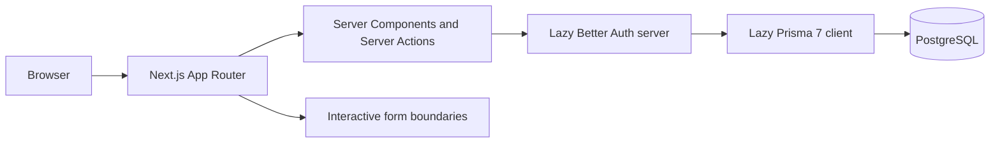

# CareerBridge architecture

## Architecture goals

CareerBridge should support incremental delivery without locking the product into premature abstractions. The foundation favors framework conventions, typed boundaries, server-first rendering, and a relational domain that can grow alongside real workflows.

## Current system

CareerBridge is a single Next.js App Router application:



Phase 2A keeps the public marketing, mock-opportunity, theme, navigation, and identity experience intact while adding a Candidate-owned profile aggregate. The Prisma and Better Auth instances are created only from lazy getters, so importing a route or component does not create a connection pool. Personalized profile and dashboard rendering retrieves the current session and fresh profile data on the server.

## Source boundaries

- **src/app:** route composition, metadata, layouts, and route-specific entry points
- **src/components/ui:** shadcn/ui source owned by the repository
- **src/components/layout:** cross-route site chrome
- **src/components/shared:** reusable presentational components
- **src/features/auth:** role rules, Zod boundaries, forms, Server Actions, and session authorization
- **src/features/candidate-profile:** profile schemas, completion logic, form UI, server queries, ownership-scoped commands, and Server Actions
- **src/features:** domain-oriented UI, actions, schemas, and queries
- **src/config:** stable site configuration and mock foundation data
- **src/lib:** infrastructure clients and low-level utilities
- **src/types:** genuinely shared TypeScript contracts
- **prisma:** Prisma 7 schema and reviewed migrations
- **scripts:** explicit operational commands such as development Admin bootstrap
- **tests:** focused custom validation and authorization tests

New folders should be created only when they have an implementation to hold.

Unit tests run without PostgreSQL through `npm test`. Database-backed auth integration tests are isolated in a separate Vitest configuration and require both `RUN_DATABASE_INTEGRATION_TESTS=true` and a dedicated `TEST_DATABASE_URL`; they never fall back to the application `DATABASE_URL` and refuse an exact match with either application database URL.

## Rendering model

- Pages and layouts are React Server Components by default.
- Client Components are limited to browser state or event-driven interaction.
- Current client boundaries are theme switching, the theme provider, Radix primitives, mobile navigation, and React Hook Form authentication/profile forms.
- Public routes retain their Phase 0 presentation. The session-aware shared header makes route rendering request-aware.
- Protected dashboards and Candidate profile routes validate the database session and exact role before rendering.

## Planned application layers

Feature modules will evolve toward a consistent shape without requiring every feature to use every layer:

```text
features/<feature>/
├── components/     # Feature UI
├── schemas/        # Zod input and output contracts
├── server/         # Queries, commands, and authorization
└── types.ts        # Feature-local contracts when needed
```

Route files should compose feature modules rather than accumulating domain logic.

## Data architecture

- PostgreSQL is the system of record.
- Prisma 7 provides type-safe access through the PostgreSQL driver adapter.
- The identity schema contains Better Auth's `User`, `Account`, `Session`, and `Verification` models plus the Prisma `Role` enum.
- The `Role` enum contains `CANDIDATE`, `RECRUITER`, and `ADMIN`; `CANDIDATE` is the least-privileged database default.
- The official Better Auth CLI generated the compatible Prisma core models. The strongly typed Prisma role enum was then applied through migration `20260710020153_identity_foundation`.
- Phase 2A adds only `CandidateProfile`, `Education`, `Experience`, `Skill`, and `CandidateSkill`, plus the constrained `EmploymentType` enum.
- Database access remains server-only and is acquired through the lazy singleton helper.

Future domain areas include companies and memberships, jobs, saved jobs, applications and status history, documents, moderation, notifications, and audit events. This list is directional, not a committed schema.

### Candidate profile domain

`User` has an optional one-to-one `CandidateProfile` through a unique `userId`. The profile owns zero or more `Education` and `Experience` rows; deleting the user or profile cascades through those private records. `Skill` is a shared normalized catalog. `CandidateSkill` is an explicit join with a composite `(candidateProfileId, skillId)` primary key, preventing repeat assignment even under concurrent requests.

Names and email stay on `User` rather than being duplicated. Optional profile fields remain nullable. Database-native lengths bound headlines, locations, URLs, descriptions, and skill names. Education years use small integers; experience dates use PostgreSQL `DATE`; employment type is an enum. The additive `20260710172118_candidate_profile_foundation` migration creates these tables, indexes, enum, foreign keys, and cascade behavior without resetting identity data.

Candidate profile routes are:

- `/candidate/profile` for the server-rendered overview and completion guidance
- `/candidate/profile/edit` for basic professional information
- `/candidate/profile/education/new` and `/candidate/profile/education/[id]/edit`
- `/candidate/profile/experience/new` and `/candidate/profile/experience/[id]/edit`

Profile completion is computed rather than persisted. Headline, location, bio, at least one skill, at least one education record, and at least one experience record each contribute 15 points. At least one professional link contributes 10 points. The calculator returns both the 0–100 percentage and deterministic missing-section recommendations.

## Authentication and authorization

Better Auth 1.6 is the identity and session library. The official Prisma adapter uses the existing Prisma 7 client and `@prisma/adapter-pg` architecture. Runtime queries use pooled `DATABASE_URL`; Prisma CLI validation and migration operations use direct `DIRECT_URL` through `prisma.config.ts`.

Email/password authentication is enabled with Better Auth's password hashing and credential verification. Sessions are stored in PostgreSQL, expire after seven days, and refresh after one day of use. Cookies use an application-specific prefix, HTTP-only/Lax defaults, and the Secure attribute in production. The base URL is explicit, development origins are allow-listed only outside production, and supported per-endpoint rate limits protect sign-in and sign-up. Credential Server Actions invoke Better Auth's HTTP handler rather than its direct server API so the handler's origin and rate-limit middleware runs; successful `Set-Cookie` values are parsed with Better Auth's cookie utilities and written through Next.js's Server Action cookie API.

Public role registration is deliberately narrow:

- The registration Server Action validates and normalizes the complete payload with Zod, including terms acceptance.
- Only `CANDIDATE` and `RECRUITER` pass the shared public role allow-list.
- A Better Auth database hook repeats the allow-list at user creation, while a user-update hook rejects every payload containing `role`.
- Mounted Better Auth routes use an explicit allow-list containing only session retrieval, sign-in, and sign-out. Registration and user updates cannot bypass the application Server Action and authorization boundaries.
- `ADMIN` exists in the database enum but can only be created through the gated development bootstrap workflow.

Authorization is centralized in `getCurrentSession`, `getCurrentUser`, `requireUser`, `requireGuest`, `requireRole`, role-to-dashboard mapping, and safe internal-path helpers. Protected pages call `requireRole` directly. Server Actions call guest/user guards inside the action. Future protected Route Handlers must return 401/403 when redirects are unsuitable and must call the same authoritative session layer. No middleware or proxy is used as the final security boundary.

Candidate profile Server Actions call `requireRole("CANDIDATE")` independently of page rendering. They construct the actor from the authenticated session and do not accept browser-supplied ownership or role fields. Update and delete commands include `candidateProfile.userId` in their database predicates; a miss becomes the same unavailable-record result whether a row is absent or belongs to someone else. Shared command functions repeat the Candidate role assertion, which also makes database integration boundaries directly testable. Admin follows the existing exact-role policy and receives no implicit Candidate-data access.

Phase 1 intentionally assigns one platform role per user. Company membership and recruiter permissions, production Admin elevation/auditing, account recovery, deletion, and retention behavior remain later design work.

## Validation and forms

- Zod will validate data at every untrusted boundary.
- React Hook Form drives accessible client interactions while the same Zod schemas remain authoritative in Server Actions.
- Server-side validation remains authoritative even when client validation exists.
- Form components must provide accessible labels, instructions, errors, and pending states.
- Candidate professional URLs are normalized only after a valid `http` or `https` protocol check.
- Education and experience current/end-date invariants are enforced by shared Zod schemas before every write.
- Skill names are NFKC-normalized, trimmed, whitespace-collapsed, character-limited, and compared by a lower-case lookup name.

## File and document handling

CV upload is not implemented in the foundation. A later design must use private object storage, short-lived access URLs, content-type and size validation, malware scanning where appropriate, retention rules, and explicit recruiter authorization.

## Security and privacy

- Secrets live in environment variables and never in tracked files.
- Database and service clients are server-only and initialized lazily.
- Passwords are handled only by Better Auth and are never logged or stored in plaintext.
- Next.js development Server Function logging is disabled so authentication action arguments are never serialized to the terminal.
- Auth failure diagnostics are prefixed and structured, and include only an event name, failure category, HTTP status, and allow-listed error code/type. Request bodies, identifiers, messages, cookies, tokens, secrets, and database URLs are excluded.
- Session tokens and cookies are never exposed to client components or logs.
- Redirect callbacks accept only normalized same-origin paths authorized for the session role.
- Public registration cannot assign `ADMIN`.
- Protected mutations require authentication, authorization, validation, and audit context.
- Sensitive candidate data follows least-privilege access.
- Security headers, rate limiting, CSRF posture, content policy, and abuse controls are hardened before public launch.

## Accessibility and interface system

- shadcn/ui and Radix primitives provide accessible interaction foundations.
- Theme variables are the source of truth for color and surface styling.
- Light and dark themes must both meet contrast expectations.
- Semantic elements, keyboard support, focus visibility, reduced-motion behavior, and responsive layouts are release requirements.

## Technical decisions

| Decision                        | Rationale                                                                          |
| ------------------------------- | ---------------------------------------------------------------------------------- |
| Next.js App Router              | Server-first rendering, route composition, metadata, and a unified full-stack path |
| TypeScript strict mode          | Stronger contracts and safer refactoring                                           |
| Tailwind CSS 4 and theme tokens | Consistent responsive styling with a small CSS surface                             |
| shadcn/ui with Radix            | Accessible primitives owned and customizable in-repository                         |
| PostgreSQL and Prisma 7         | Relational integrity, migrations, and type-safe queries                            |
| Better Auth and Prisma adapter  | Maintained credential hashing, sessions, cookies, and generated identity models    |
| Single typed platform role      | Minimal Phase 1 authorization model that can evolve with later ownership rules     |
| npm                             | Simple, widely supported package workflow                                          |
| Server Components by default    | Less client JavaScript and clear server/client boundaries                          |
| Narrow Phase 2A profile schema  | Adds only reviewed Candidate ownership and lifecycle relationships                 |

## Local migration workflow

1. Configure pooled `DATABASE_URL` and direct `DIRECT_URL` in the untracked `.env`.
2. Edit `prisma/schema.prisma` using Prisma 7 conventions; do not add a datasource URL to the schema.
3. Run `npm run prisma:validate` and `npm run prisma:generate`.
4. Run `npm run prisma:migrate:dev -- --name <clear_name>` against the development database.
5. Review the generated SQL before sharing the change. Never reset a populated database without explicit approval.

## Development Admin bootstrap

The `npm run admin:bootstrap` command requires `ADMIN_BOOTSTRAP_ENABLED=true`, a dedicated `ADMIN_BOOTSTRAP_DATABASE_URL`, and validated name, email, password, Better Auth URL, and Better Auth secret variables. It refuses known production environments and never infers database safety from the web origin. Both Better Auth credential creation and Prisma promotion use the dedicated client. The command refuses to elevate an existing non-Admin account, removes the bootstrap-created session, and is idempotent when the Admin already exists. Credentials and connection strings are never hardcoded or printed.

## Deployment direction

The application is compatible with standard Node.js hosting and is a natural fit for Vercel. A later deployment phase will add managed PostgreSQL, environment separation, preview deployments, migration policy, observability, backups, and CI quality gates.
