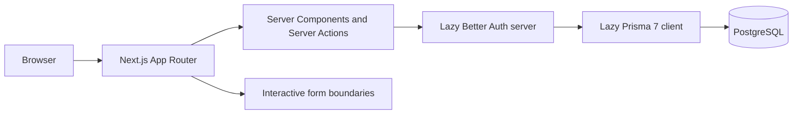

# CareerBridge architecture

## Architecture goals

CareerBridge should support incremental delivery without locking the product into premature abstractions. The foundation favors framework conventions, typed boundaries, server-first rendering, and a relational domain that can grow alongside real workflows.

## Current system

CareerBridge is a single Next.js App Router application:



Phase 3B keeps the completed identity, profile, Company, Job, and application experiences intact while adding Candidate-owned Saved Jobs: fresh save eligibility checks, duplicate-safe mutations, a private searchable list, retained unavailable history, and real Candidate dashboard integration. The Prisma and Better Auth instances are created only from lazy getters, so importing a route or component does not create a connection pool. Personalized profile, dashboard, Company workspace, Job workspace, application, and Saved Job rendering retrieves the current session and fresh data on the server.

## Source boundaries

- **src/app:** route composition, metadata, layouts, and route-specific entry points
- **src/components/ui:** shadcn/ui source owned by the repository
- **src/components/layout:** cross-route site chrome
- **src/components/shared:** reusable presentational components
- **src/features/auth:** role rules, Zod boundaries, forms, Server Actions, and session authorization
- **src/features/candidate-profile:** profile schemas, completion logic, form UI, server queries, ownership-scoped commands, and Server Actions
- **src/features/recruiter-company:** Recruiter/Company schemas, slug and publication rules, form UI, membership-scoped queries, commands, and Server Actions
- **src/features/jobs:** Job schemas, slug, lifecycle, publication readiness, and public search rules, plus form UI, OWNER-scoped queries, commands, and Server Actions
- **src/features/applications:** application lifecycle, eligibility, cover-letter and search schemas, and search mapping, plus form UI, candidate- and OWNER-scoped queries, commands, and Server Actions
- **src/features/saved-jobs:** save eligibility, availability, validation, dashboard recommendation logic, interactive controls, and Candidate-scoped server reads and mutations
- **src/features:** domain-oriented UI, actions, schemas, and queries
- **src/config:** stable site navigation and configuration
- **src/lib:** infrastructure clients and low-level utilities
- **src/types:** genuinely shared TypeScript contracts
- **prisma:** Prisma 7 schema and reviewed migrations
- **scripts:** explicit operational commands such as development Admin bootstrap
- **tests:** focused custom validation and authorization tests

New folders should be created only when they have an implementation to hold.

Unit tests run without PostgreSQL through `npm test`. Database-backed auth integration tests are isolated in a separate Vitest configuration and require both `RUN_DATABASE_INTEGRATION_TESTS=true` and a dedicated `TEST_DATABASE_URL`; they never fall back to the application `DATABASE_URL` and refuse an exact match with either application database URL.

## Rendering model

- Pages and layouts are React Server Components by default.
- Client Components are limited to browser state or event-driven interaction.
- Current client boundaries are theme switching, the theme provider, Radix primitives, mobile navigation, and React Hook Form authentication/profile forms.
- Public Company and Job routes are server-rendered from published database records; the landing page renders newest published Jobs. The session-aware shared header makes route rendering request-aware.
- Protected dashboards, Candidate profile routes, Recruiter Company routes, and Recruiter Job routes validate the database session and exact role before rendering.

## Planned application layers

Feature modules will evolve toward a consistent shape without requiring every feature to use every layer:

```text
features/<feature>/
├── components/     # Feature UI
├── schemas/        # Zod input and output contracts
├── server/         # Queries, commands, and authorization
└── types.ts        # Feature-local contracts when needed
```

Route files should compose feature modules rather than accumulating domain logic.

## Data architecture

- PostgreSQL is the system of record.
- Prisma 7 provides type-safe access through the PostgreSQL driver adapter.
- The identity schema contains Better Auth's `User`, `Account`, `Session`, and `Verification` models plus the Prisma `Role` enum.
- The `Role` enum contains `CANDIDATE`, `RECRUITER`, and `ADMIN`; `CANDIDATE` is the least-privileged database default.
- The official Better Auth CLI generated the compatible Prisma core models. The strongly typed Prisma role enum was then applied through migration `20260710020153_identity_foundation`.
- Phase 2A adds only `CandidateProfile`, `Education`, `Experience`, `Skill`, and `CandidateSkill`, plus the constrained `EmploymentType` enum.
- Phase 2B adds only `RecruiterProfile`, `Company`, and `CompanyMembership`, plus `CompanySize` and `CompanyMembershipRole` enums.
- Phase 2C adds only `Job` and `JobSkill`, plus the `JobStatus`, `WorkplaceType`, and `ExperienceLevel` enums, and reuses the existing `EmploymentType` enum and `Skill` catalog.
- Phase 3A adds only `JobApplication` and `ApplicationStatusHistory`, plus the `ApplicationStatus` enum, and reads authorized current `User` and `CandidateProfile` data rather than duplicating candidate name or email.
- Phase 3B adds only `SavedJob`, reads current Job/Company/Application data through authorized projections, and duplicates no Candidate, Job, Company, skill, or application fields.
- Database access remains server-only and is acquired through the lazy singleton helper.

Future domain areas include documents, recruiter-only notes, recommendations, alerts, moderation, notifications, and audit events. This list is directional, not a committed schema.

### Candidate profile domain

`User` has an optional one-to-one `CandidateProfile` through a unique `userId`. The profile owns zero or more `Education` and `Experience` rows; deleting the user or profile cascades through those private records. `Skill` is a shared normalized catalog. `CandidateSkill` is an explicit join with a composite `(candidateProfileId, skillId)` primary key, preventing repeat assignment even under concurrent requests.

Names and email stay on `User` rather than being duplicated. Optional profile fields remain nullable. Database-native lengths bound headlines, locations, URLs, descriptions, and skill names. Education years use small integers; experience dates use PostgreSQL `DATE`; employment type is an enum. The additive `20260710172118_candidate_profile_foundation` migration creates these tables, indexes, enum, foreign keys, and cascade behavior without resetting identity data.

Candidate profile routes are:

- `/candidate/profile` for the server-rendered overview and completion guidance
- `/candidate/profile/edit` for basic professional information
- `/candidate/profile/education/new` and `/candidate/profile/education/[id]/edit`
- `/candidate/profile/experience/new` and `/candidate/profile/experience/[id]/edit`

Profile completion is computed rather than persisted. Headline, location, bio, at least one skill, at least one education record, and at least one experience record each contribute 15 points. At least one professional link contributes 10 points. The calculator returns both the 0–100 percentage and deterministic missing-section recommendations.

### Recruiter and Company domain

`User` has an optional one-to-one `RecruiterProfile` through unique `userId`; account name and email remain solely on `User`. `CompanyMembership` is an explicit join from `User` to `Company` with unique `(userId, companyId)`, indexed actor/company roles, and the narrow `OWNER`/`MEMBER` enum. The schema permits multiple Company memberships per Recruiter. Company creation writes the private Company and its OWNER membership in one serializable transaction, so a successful Company cannot be ownerless through this workflow.

`Company` stores a unique stable slug, bounded descriptive fields, optional `CompanySize`, realistic small-integer founded year, and `isPublished = false` by default. Slugs are derived only from the validated Company name on the server. The allocator NFKD-normalizes to a bounded ASCII slug, uses `company` as a non-Latin fallback, and chooses the first free deterministic suffix (`name`, `name-2`, `name-3`). Serializable creation plus retry on unique/write conflicts protects concurrent collision handling. Editing a Company name does not rotate its established URL.

Private workspace reads require an authenticated Recruiter membership. `MEMBER` can read the private workspace but cannot mutate in Phase 2B. Edit and publish commands include the authenticated user's OWNER membership in their database predicate; absent, foreign, and unauthorized IDs produce the same unavailable result. Admin is not an implicit owner. Browser input never supplies a trusted user ID, membership ID, owner role, slug, or publication flag.

Publishing is an explicit OWNER command. The server requires name, description, industry, headquarters, and a validated HTTP(S) website before setting `isPublished`. Unpublishing is a separate OWNER command. Public list and detail queries always constrain `isPublished: true`, return no membership identity, and treat an unknown or unpublished slug identically. Publication is a visibility state and never Company verification.

Recruiter routes are `/recruiter/profile`, `/recruiter/profile/edit`, `/recruiter/companies`, `/recruiter/companies/new`, `/recruiter/companies/[companyId]`, and `/recruiter/companies/[companyId]/edit`. Public discovery uses `/companies` with bounded URL filters and `/companies/[slug]` for published detail. Invitations, membership administration, Company verification, and uploads remain deferred.

### Job domain

`Company` owns zero or more `Job` rows; deleting a Company cascades to its Jobs and their `JobSkill` links. `Job` stores a globally unique server-generated slug, bounded plain-text content fields, the reused `EmploymentType` enum plus the new `WorkplaceType` and `ExperienceLevel` enums, an integer salary range with a `CHAR(3)` currency code, an optional `DATE` application deadline, and the `JobStatus` lifecycle with server-only `publishedAt`/`closedAt` timestamps. `JobSkill` is an explicit join to the shared `Skill` catalog with a composite `(jobId, skillId)` primary key, preventing duplicate assignment. Indexes cover Company workspace queries (`companyId, status, createdAt`) and public discovery (`status, publishedAt, id`). The additive `20260710224143_job_lifecycle_discovery` migration creates these tables, enums, indexes, and cascade behavior without touching existing data.

Salary is persisted as whole non-negative integer currency units rather than a floating-point or minor-unit representation, and the minimum can never exceed the maximum. The currency code is normalized to an uppercase 3-letter form and is required whenever any salary value is present. Application deadlines are date-only and compared in UTC so a timezone offset never shifts the day; a past deadline blocks publication.

The lifecycle is centralized and testable: DRAFT permits edit, publish, and archive; PUBLISHED permits edit, close, and archive; CLOSED permits archive; ARCHIVED is read-only. Transitions, the resulting status, and editability all derive from a single table, so no status value is ever accepted from form input. Publishing is an OWNER command that re-evaluates readiness against freshly read database rows: the Company must be published and the Job must have a title, summary, description, responsibilities, requirements, location, employment type, workplace type, experience level, and at least one required skill. Publishing sets `PUBLISHED` and `publishedAt`; closing sets `CLOSED` and `closedAt` and immediately removes the Job from public discovery; archiving sets `ARCHIVED` and removes it from discovery. Editing a published Job re-checks readiness so a live listing cannot become incomplete.

Every Job command asserts the RECRUITER role, derives identity from the session, and scopes its database predicate through the authenticated user's OWNER membership of the Job's Company. Absent, foreign, and unauthorized Job IDs produce the same unavailable result, so a Recruiter cannot view or edit another Company's private drafts, and a MEMBER cannot mutate Jobs. Public list and detail queries always constrain `status = PUBLISHED` and `Company.isPublished = true`, select only presentational fields with no internal IDs or membership identity, and order by newest `publishedAt` with a deterministic `id` tiebreaker. Recruiter Job routes are `/recruiter/jobs`, `/recruiter/jobs/new`, `/recruiter/jobs/[jobId]`, and `/recruiter/jobs/[jobId]/edit`; public discovery uses `/jobs` with bounded URL filters and `/jobs/[slug]` for published detail. Candidate matching, recommendations, alerts, and Job analytics remain deferred.

### Application domain

`JobApplication` belongs to exactly one `Job` and one Candidate `User` (`candidateId`), stores an optional bounded-plain-text cover letter, an `ApplicationStatus`, and server-set `submittedAt`/`withdrawnAt` timestamps. A database-level unique `(jobId, candidateId)` constraint enforces one application per Candidate per Job; indexes cover candidate lists (`candidateId, status, submittedAt`) and recruiter job lists (`jobId, status, submittedAt`). `ApplicationStatusHistory` records `fromStatus` (nullable for the initial SUBMITTED event), `toStatus`, and a nullable `changedByUserId` (`onDelete: SetNull` so history survives account removal), indexed by `applicationId, createdAt`. Deleting a Job or Candidate cascades to their applications and history. The additive `20260711001124_job_applications_pipeline` migration creates these tables and the enum without touching existing data. Candidate name and email are read from authorized live `User`/`CandidateProfile` data, never duplicated onto the application.

Eligibility is re-evaluated against fresh database rows inside the create mutation: the Candidate role, a `PUBLISHED` Job under a published Company, an absent or future deadline (date-only, UTC), no existing application, and a minimum profile of headline, location, and at least one skill. Incomplete profiles return a safe message listing the missing fields and never create a row. The unique constraint plus P2002 handling makes duplicate and concurrent submissions resolve to a clean already-applied result without a second history row.

The lifecycle is centralized and database-free. Recruiter-controlled forward transitions are SUBMITTED → UNDER_REVIEW → INTERVIEW → OFFER → HIRED, with REJECTED reachable from any active state; HIRED, REJECTED, and WITHDRAWN are terminal. A recruiter can never set WITHDRAWN, only the Candidate can withdraw (and only from an active state), and no backward or terminal transition is accepted. Each accepted change updates the status and appends an `ApplicationStatusHistory` row in the same transaction, using a compare-and-set on the prior status so a concurrent change cannot double-apply. Applications are retained after withdrawal or rejection and are never hard-deleted in normal workflow.

Candidate reads and mutations are scoped by `candidateId` from the session; recruiter reads and mutations are scoped through OWNER membership of the Job's Company. Absent, foreign, and MEMBER-only IDs return the same not-found, so cross-candidate, cross-company, and MEMBER access fail identically and foreign application existence is never leaked. A recruiter sees a candidate's private profile only because the candidate applied to their job and only as an OWNER; candidate-facing history omits the acting user. Candidate routes are `/candidate/applications` and `/candidate/applications/[applicationId]`; the apply form is `/jobs/[slug]/apply`; recruiter routes are `/recruiter/applications`, `/recruiter/applications/[applicationId]`, and `/recruiter/jobs/[jobId]/applications`. CV upload and access, recruiter-only notes, notifications, and messaging remain deferred.

### Saved Job domain

`SavedJob` is an explicit join from Candidate `User` to `Job` with server-set `createdAt`. Unique `(candidateId, jobId)` is the database authority for one save per Candidate per Job. Indexes on `(candidateId, createdAt, id)` and `jobId` support deterministic newest-first Candidate lists and relation maintenance. Both foreign keys cascade, matching existing Candidate and Job ownership cleanup. The additive `20260711023016_saved_jobs` migration creates only this table, indexes, and constraints.

New saves require an authenticated Candidate and re-read the Job with `status = PUBLISHED` plus `Company.isPublished = true` inside the mutation. Candidate identity is never accepted from input. P2002 duplicate handling makes sequential or concurrent duplicate saves idempotent; Candidate-and-Job-scoped `deleteMany` makes removal idempotent and unable to reveal another Candidate's save.

Saved rows intentionally survive Job close/archive and Company unpublication. Candidate reads classify a row as OPEN only while the Job remains publicly queryable; every other row is UNAVAILABLE. Unavailable cards retain only Candidate-authorized presentational history, offer removal, never link to a private route, and never cause a Job to reappear publicly. Public Job queries keep their existing explicit projections and expose no SavedJob rows, Candidate identity, or save counts. `/jobs` loads saved slugs in one bounded query for Candidate sessions; `/candidate/saved-jobs` validates bounded title/Company/location/skill search and `ALL`/`OPEN`/`UNAVAILABLE` filters, then returns at most 100 rows in stable newest-saved order.

## Authentication and authorization

Better Auth 1.6 is the identity and session library. The official Prisma adapter uses the existing Prisma 7 client and `@prisma/adapter-pg` architecture. Runtime queries use pooled `DATABASE_URL`; Prisma CLI validation and migration operations use direct `DIRECT_URL` through `prisma.config.ts`.

Email/password authentication is enabled with Better Auth's password hashing and credential verification. Sessions are stored in PostgreSQL, expire after seven days, and refresh after one day of use. Cookies use an application-specific prefix, HTTP-only/Lax defaults, and the Secure attribute in production. The base URL is explicit, development origins are allow-listed only outside production, and supported per-endpoint rate limits protect sign-in and sign-up. Credential Server Actions invoke Better Auth's HTTP handler rather than its direct server API so the handler's origin and rate-limit middleware runs; successful `Set-Cookie` values are parsed with Better Auth's cookie utilities and written through Next.js's Server Action cookie API.

Public role registration is deliberately narrow:

- The registration Server Action validates and normalizes the complete payload with Zod, including terms acceptance.
- Only `CANDIDATE` and `RECRUITER` pass the shared public role allow-list.
- A Better Auth database hook repeats the allow-list at user creation, while a user-update hook rejects every payload containing `role`.
- Mounted Better Auth routes use an explicit allow-list containing only session retrieval, sign-in, and sign-out. Registration and user updates cannot bypass the application Server Action and authorization boundaries.
- `ADMIN` exists in the database enum but can only be created through the gated development bootstrap workflow.

Authorization is centralized in `getCurrentSession`, `getCurrentUser`, `requireUser`, `requireGuest`, `requireRole`, role-to-dashboard mapping, and safe internal-path helpers. Protected pages call `requireRole` directly. Server Actions call guest/user guards inside the action. Future protected Route Handlers must return 401/403 when redirects are unsuitable and must call the same authoritative session layer. No middleware or proxy is used as the final security boundary.

Candidate profile Server Actions call `requireRole("CANDIDATE")` independently of page rendering. They construct the actor from the authenticated session and do not accept browser-supplied ownership or role fields. Update and delete commands include `candidateProfile.userId` in their database predicates; a miss becomes the same unavailable-record result whether a row is absent or belongs to someone else. Shared command functions repeat the Candidate role assertion, which also makes database integration boundaries directly testable. Admin follows the existing exact-role policy and receives no implicit Candidate-data access.

Recruiter Company Server Actions independently call `requireRole("RECRUITER")`, derive the actor from the server session, and map only validated fields. Company commands repeat the role assertion and scope writes through OWNER membership. Private membership reads and OWNER-only edits are re-authorized on every request; hiding controls is never treated as authorization. Phase 1 still assigns one platform role per user, while Company membership is a separate domain permission. Production Admin elevation/auditing, account recovery, deletion, and retention behavior remain later design work.

Job Server Actions independently call `requireRole("RECRUITER")`, derive the actor from the server session, validate the lifecycle action against a fixed enum, and map only validated content fields. Every Job command repeats the role assertion and scopes reads and writes through the authenticated user's OWNER membership of the Job's Company, re-authorizing each Job ID rather than trusting a browser-supplied `companyId`, status, or ownership field. Lifecycle transitions and publication readiness are re-evaluated inside the authorized command against fresh database data, so a hidden or replayed request cannot force an invalid status or publish an incomplete Job.

Application Server Actions independently call `requireRole("CANDIDATE")` for apply/withdraw and `requireRole("RECRUITER")` for status transitions, and derive identity from the session so `candidateId`, `recruiterId`, Company ownership, `submittedAt`, `withdrawnAt`, and status history are never client-controlled. The recruiter transition action validates the destination against a fixed enum that omits SUBMITTED and WITHDRAWN, then the command re-loads the current status from the database and re-validates the transition through the centralized lifecycle table before a compare-and-set update writes the status and its history row atomically. Every application command re-authorizes the application ID under candidate ownership or OWNER membership, returns safe generic errors, and never exposes Prisma internals or foreign application existence.

Saved Job Server Actions independently call `requireRole("CANDIDATE")`, derive `candidateId` from the session, validate only the bounded Job slug, and re-check Job/Company publication for every new save. Removal scopes the relation by the same session Candidate and Job slug. Recruiter and Admin roles cannot save or remove, foreign relation existence is never disclosed, and action results contain only safe UI state and generic messages.

## Validation and forms

- Zod will validate data at every untrusted boundary.
- React Hook Form drives accessible client interactions while the same Zod schemas remain authoritative in Server Actions.
- Server-side validation remains authoritative even when client validation exists.
- Form components must provide accessible labels, instructions, errors, and pending states.
- Candidate professional URLs are normalized only after a valid `http` or `https` protocol check.
- Education and experience current/end-date invariants are enforced by shared Zod schemas before every write.
- Skill names are NFKC-normalized, trimmed, whitespace-collapsed, character-limited, and compared by a lower-case lookup name.
- Recruiter and Company optional text is trimmed and explicitly mapped to database nulls; unknown browser fields are stripped and never mass-assigned.
- LinkedIn and Company websites reject malformed, protocol-relative, `javascript:`, `data:`, `file:`, and other unsupported protocols before URL normalization.
- Company size is an explicit enum, founded year is bounded from 1600 through the current UTC year, and public filters are trimmed and limited to 100 characters.
- Saved Job search is trimmed and limited to 100 characters; availability accepts only `ALL`, `OPEN`, or `UNAVAILABLE`, unknown fields are ignored, and server queries remain Candidate-scoped and capped at 100 rows.

## File and document handling

CV upload is not implemented in the foundation. A later design must use private object storage, short-lived access URLs, content-type and size validation, malware scanning where appropriate, retention rules, and explicit recruiter authorization.

## Security and privacy

- Secrets live in environment variables and never in tracked files.
- Database and service clients are server-only and initialized lazily.
- Passwords are handled only by Better Auth and are never logged or stored in plaintext.
- Next.js development Server Function logging is disabled so authentication action arguments are never serialized to the terminal.
- Auth failure diagnostics are prefixed and structured, and include only an event name, failure category, HTTP status, and allow-listed error code/type. Request bodies, identifiers, messages, cookies, tokens, secrets, and database URLs are excluded.
- Session tokens and cookies are never exposed to client components or logs.
- Redirect callbacks accept only normalized same-origin paths authorized for the session role.
- Public registration cannot assign `ADMIN`.
- Protected mutations require authentication, authorization, validation, and audit context.
- Sensitive candidate data follows least-privilege access.
- Security headers, rate limiting, CSRF posture, content policy, and abuse controls are hardened before public launch.

## Accessibility and interface system

- shadcn/ui and Radix primitives provide accessible interaction foundations.
- Theme variables are the source of truth for color and surface styling.
- Light and dark themes must both meet contrast expectations.
- Semantic elements, keyboard support, focus visibility, reduced-motion behavior, and responsive layouts are release requirements.

## Technical decisions

| Decision                         | Rationale                                                                          |
| -------------------------------- | ---------------------------------------------------------------------------------- |
| Next.js App Router               | Server-first rendering, route composition, metadata, and a unified full-stack path |
| TypeScript strict mode           | Stronger contracts and safer refactoring                                           |
| Tailwind CSS 4 and theme tokens  | Consistent responsive styling with a small CSS surface                             |
| shadcn/ui with Radix             | Accessible primitives owned and customizable in-repository                         |
| PostgreSQL and Prisma 7          | Relational integrity, migrations, and type-safe queries                            |
| Better Auth and Prisma adapter   | Maintained credential hashing, sessions, cookies, and generated identity models    |
| Single typed platform role       | Minimal Phase 1 authorization model that can evolve with later ownership rules     |
| npm                              | Simple, widely supported package workflow                                          |
| Server Components by default     | Less client JavaScript and clear server/client boundaries                          |
| Narrow Phase 2A profile schema   | Adds only reviewed Candidate ownership and lifecycle relationships                 |
| Explicit Company membership      | Separates platform role from extensible Company ownership without implicit access  |
| Private-by-default publication   | Prevents incomplete or unapproved Company and Job records from entering discovery  |
| Centralized Job lifecycle        | A single server-owned transition table blocks arbitrary status changes from forms  |
| DB-unique application constraint | `unique(jobId, candidateId)` makes duplicate and concurrent applies safe by design |
| Atomic status + history writes   | Each status change and its history row commit in one transaction, never partially  |
| Integer salary representation    | Stores money as exact whole currency units instead of floats or minor units        |

## Local migration workflow

1. Configure pooled `DATABASE_URL` and direct `DIRECT_URL` in the untracked `.env`.
2. Edit `prisma/schema.prisma` using Prisma 7 conventions; do not add a datasource URL to the schema.
3. Run `npm run prisma:validate` and `npm run prisma:generate`.
4. Run `npm run prisma:migrate:dev -- --name <clear_name>` against the development database.
5. Review the generated SQL before sharing the change. Never reset a populated database without explicit approval.
6. Apply migrations to tests only by temporarily setting Prisma's CLI connection to the distinct `TEST_DATABASE_URL`; never fall back to an application URL.

## Development Admin bootstrap

The `npm run admin:bootstrap` command requires `ADMIN_BOOTSTRAP_ENABLED=true`, a dedicated `ADMIN_BOOTSTRAP_DATABASE_URL`, and validated name, email, password, Better Auth URL, and Better Auth secret variables. It refuses known production environments and never infers database safety from the web origin. Both Better Auth credential creation and Prisma promotion use the dedicated client. The command refuses to elevate an existing non-Admin account, removes the bootstrap-created session, and is idempotent when the Admin already exists. Credentials and connection strings are never hardcoded or printed.

## Deployment direction

The application is compatible with standard Node.js hosting and is a natural fit for Vercel. A later deployment phase will add managed PostgreSQL, environment separation, preview deployments, migration policy, observability, backups, and CI quality gates.
